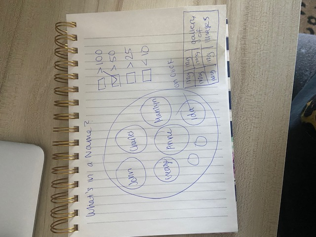

<h2>Concepts and Sketches </h2>
<h3>What's in a Name? </h3>

  
 This circle packing diagram shows the different first names tagged with New York at the National Portrait Gallery. The size of the circles is 
 based on the amount of times each first name appears. When you click on a each circle a gallery of portraits where the the subject has that first name will appear. 
 

<h3>Count Me</h3>

 
This visualization will be a continuation of the tree map used in the qualitative assignment however, rather than displaying the names on the tree map only the count of times
a first name appears will be displayed. On click of each tree map tile the first name will be displayed along with a gallery of the portraits where the subjects have that first name. 

<h3>The Extinct </h3>

 
This circle packing diagram will have added filter ability so that user's are able to filter the first name's by the amount of times they appeared in the dataset. 
When a filter is selected only those first names appearing in the dataset that amount of times will be displayed on the screen. 

