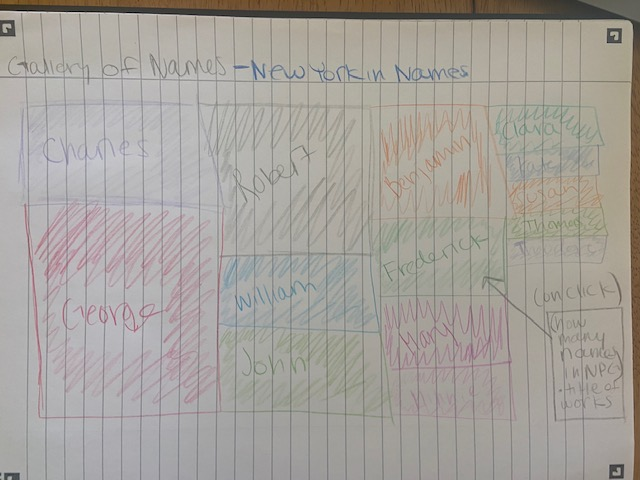
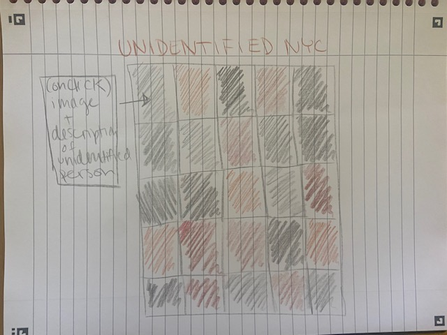
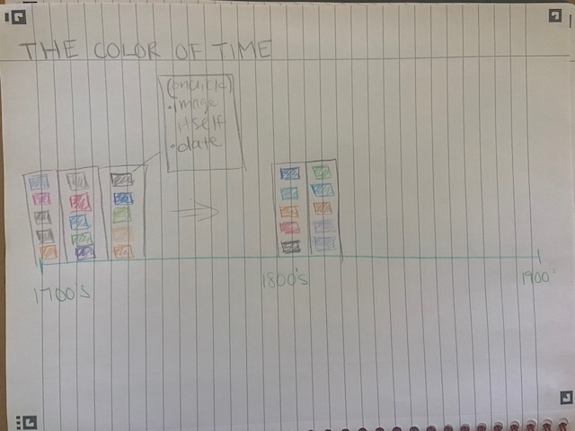

<h2>Concepts and Sketches </h2>
<h3>New York in Names </h3>

  
 This visualization queries the selection of portraits tagged with New York as the location from the National Portrait Gallery. 
 I'm hoping to create a TreeMap graph by parsing out the names of the subjects in the portraits from the API Call. I would then likely tag each name as male or female and chart the count of names using a treemap in hopes of illustrating any disparity between male and female figures pictured. 
 

<h3>Unidentified New York</h3>

 
I hope to use the subset of images in the NPG tagged with New York and titled as "Unidentified" men or women. I wanted to use the vibrant package demoed in the last lab to determine the colors associated with Unidentified figures.
I then wanted the user to be able to interact with the visualization and uncover the unidentified subject by clicking on the colored tiles. 

<h3>The Extinct </h3>

 
I hope to use the set of images gathered from the NPG and tagged as New York and sort these images by date. I then want to take a look at the colors used in portraiture over time and use the vibrant package to stack these along a horizontal timeline. 
Based on the color tiles the viewer of the visualization should easily be able to identify any trends in color patterns used in portraits over time.

