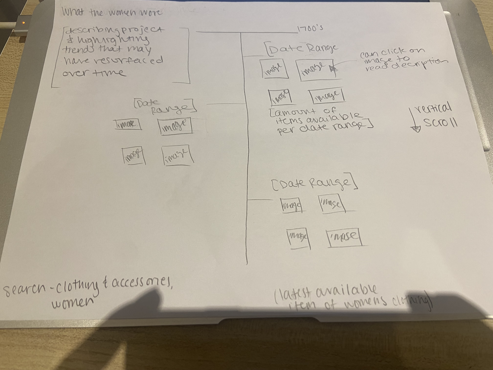
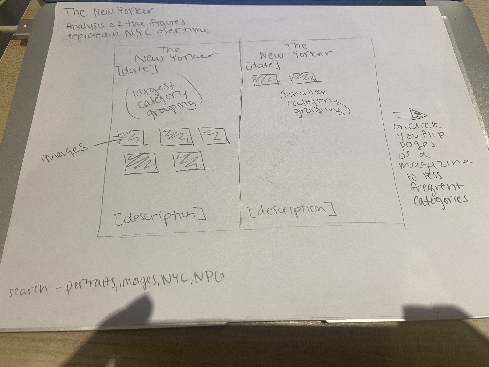
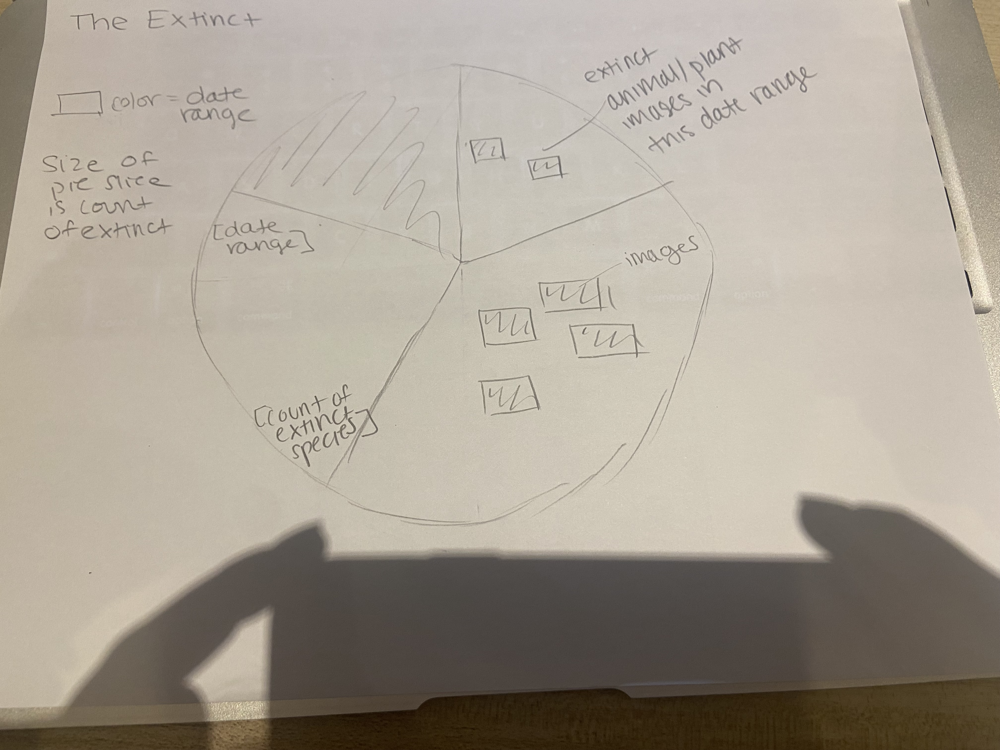

<h2>Concepts and Sketches </h2>
<h3>What the Women Wore </h3>

  
 This visualization uses the Smithsonian collection to explore women's fashion trends over time and whether any seem to have resurfaced based on the images within the digital collection. 
 I hope to query for the topic-"Clothing and Dress" and type="women" and then depict popular fashion trends appearing within various date ranges as well as number of items available from that period on a timeline. 
 I plan to use query outputs that have images as I hope to actually show the women's fashion items along with all data points available for the piece in order to put together an analysis of fashion trends over time. 
 A timeline is being used wtih vertical scroll ability so that the viewer of the project has the ability to compare and contrast trends in fashion over time.
 

<h3>The New Yorker</h3>

 
This visualization will use a interactive tree map to analyze the collection of portraits from the National Portrait Gallery over time. 
I hope to use a tree map and find similarites and differences as well as various categories within the dataset i.e. are most figures portrayed politicians, artists, etc. 
and use the interactive treemap to show the larger as well as less frequently portrayed figures in New York. 
I'm hoping to use a treemap in order to depict both amounts of portraits as well as the relationship each category to another.
I will look at the data related to the topics/types of portraits and prints in New York as well as the amount of portraits within each category.

<h3>The Extinct </h3>

 
With this last idea I hope to use search term extinction and take and analyze the animals that are extinct or endangered over time. 
I'm hoping to put together a pie chart where each slice of the pie is correlated to a date range and the sizes the slices will represent the number of animals that have gone extinct at that time. 
I'm hoping images of the extinct animals can be collaged in a way within each slice.

